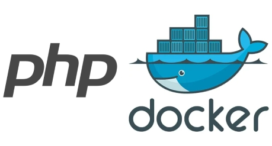

<p align="center">
  
</p>

# PHP Docker container

[](https://github.com/forge-for-gitea/php-docker/blob/master/LICENSE)
[](https://github.com/forge-for-gitea/php-docker/actions/workflows/ci.yml)
[](https://github.com/forge-for-gitea/php-docker/releases)

Lightweight **PHP 8.3 FPM (Alpine)** container.

Based on [**PHP 8.3 FPM (Alpine)**](https://hub.docker.com/_/php)

## Features

Tools:
- [**Composer**](https://getcomposer.org/) (PHP Dependency Manager)
- [**PIE**](https://github.com/php/pie) (PHP Installer for Extensions)

Core Extensions:
- [**opcache**](https://www.php.net/manual/en/book.opcache.php)
- [**curl**](https://www.php.net/manual/en/book.curl.php)
- [**phar**](https://www.php.net/manual/en/book.phar.php)

Pecl Extensions:
- [**pecl/zip**](https://pecl.php.net/package/zip)

## Usage

running php
```shell
docker run -it --rm forgeforgitea/php:8.3 -v
```

running pie
```shell
docker run -it --rm forgeforgitea/php:8.3 pie -v
```

installing extension
```shell
docker run -it --rm forgeforgitea/php:8.3 pie install pecl/pcov
```

running composer
```shell
docker run -it --rm forgeforgitea/php:8.3 composer -v
```

## Development

build
```shell
docker build . -t=php
```

running php
```shell
docker run -it --rm php -v
```

running pie
```shell
docker run -it --rm php pie -v
```

running composer
```shell
docker run -it --rm php composer -v
```